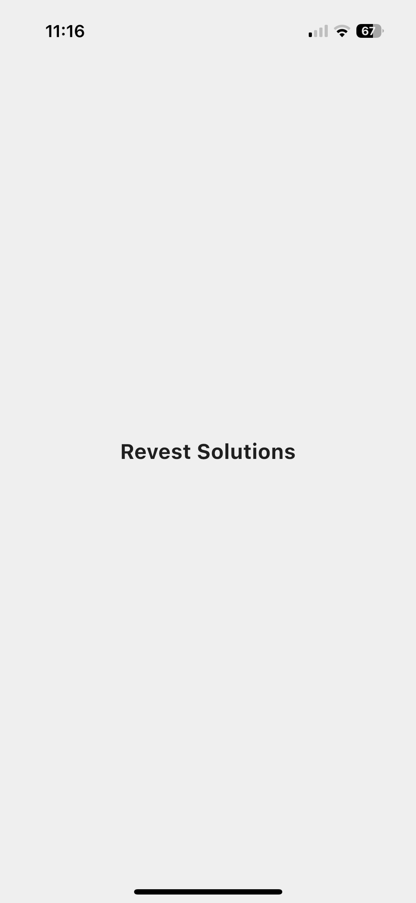
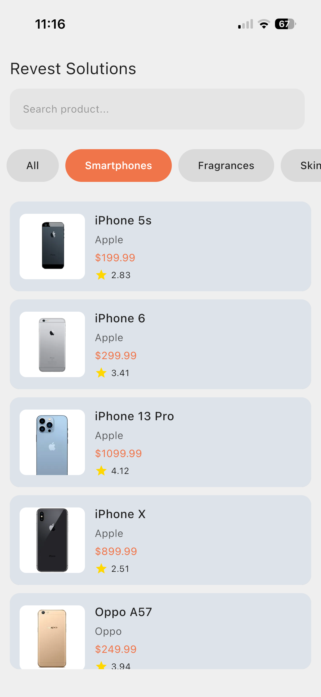
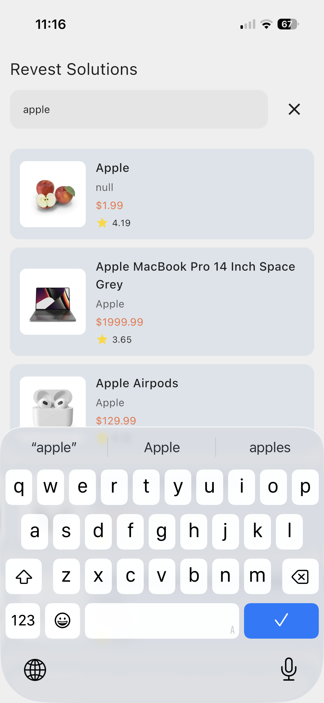
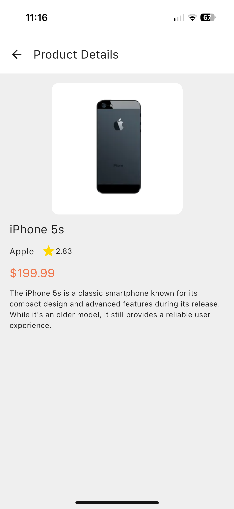
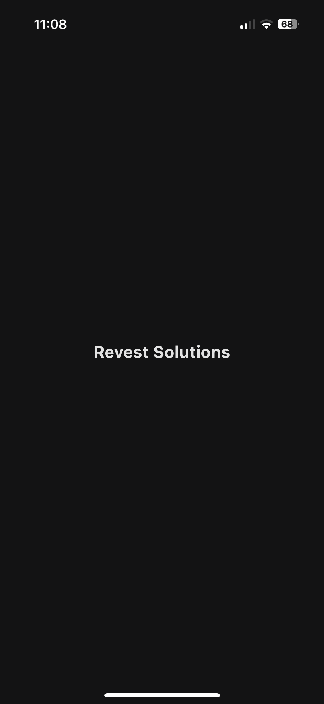
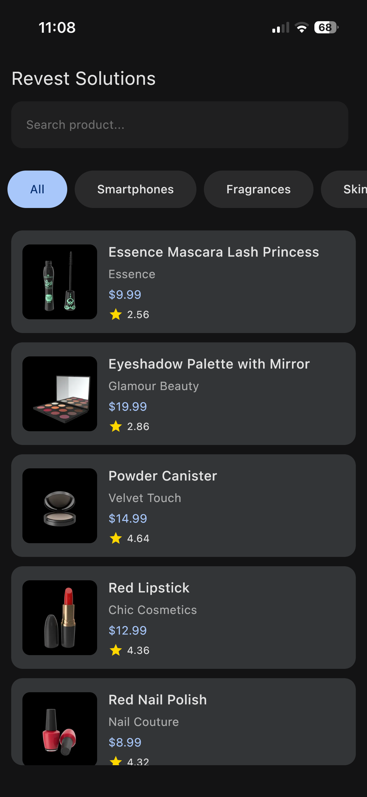
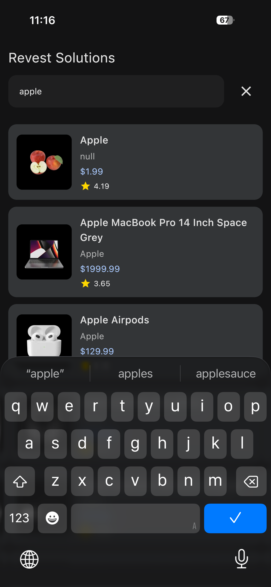
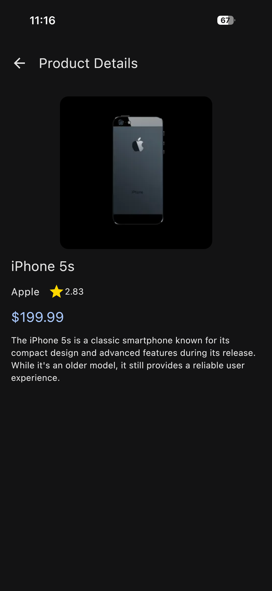

# Revest Product Browser App

**Company:** Revest Solutions Pvt. Ltd.  
**Project:** Cross-Platform Product App (Kotlin Multiplatform + Jetpack Compose)  
**Author:** Amit Bodaliya  
**GitHub:** [https://github.com/AmitBodaliya/RevestSolutions](https://github.com/AmitBodaliya/RevestSolutions)

---

## About the Project

The **Revest Product Browser App** is a cross-platform mobile application built using **Kotlin Multiplatform + Jetpack Compose Multiplatform**. It targets both **Android and iOS**, providing a clean, responsive product catalog UI.

This project was created as a technical assignment for Revest Solutions to demonstrate:

- Kotlin Multiplatform Mobile (KMM) development
- Clean architecture and MVVM design pattern
- API integration with Ktor and JSON parsing
- Shared UI components across Android and iOS using Compose
- Responsive and theme-aware UI (Light & Dark mode)
- UI state management, loading, search, and error handling

---

## App Features

- **Product List Screen**
  - Displays all products with name, price, and thumbnail
  - Infinite scrolling for smooth UX
- **Product Detail Screen**
  - Shows product title, description, brand, price, and rating
- **Search Functionality**
  - Search products by keyword
  - API-based search with debounce
- **Category Filter**
  - Filter products by category (only visible when search is inactive)
- **UI States**
  - Loading indicator while fetching data
  - Empty list state
  - Network error handling
- **Dark & Light Theme Support**
  - Fully responsive to system theme changes
- **Cross-Platform**
  - Single codebase for Android and iOS

---

## Installation & Setup

### Prerequisites
- Android Studio
- Xcode (for iOS build/testing)
- JDK 11+
- Git installed
- Internet connection for Gradle dependencies

---

### Steps to Run the Project

1. **Clone the repository**

```bash
git clone https://github.com/AmitBodaliya/RevestSolutions
```

2. 📂 Open Project in Android Studio

- Open **Android Studio**
- Click on **File → Open**
- Navigate to the cloned project folder
- Select the project and click **OK**

3. 🔄 Sync Gradle Dependencies
   
- Wait for Gradle sync to complete automatically
- If not started → Click **File → Sync Project with Gradle Files**

4. ▶️ Run the Project

- Connect an **Android Device** or start an **Android Emulator**
- Select device from the top device dropdown
- Click the **Run ▶ button**

The app will install and launch automatically.

---


## 📸 Screenshots, APK & iOS Video

## Screenshots

### Light Mode

All screenshots for Light Theme are stored in the `/files/` folder.

<p align="center">
  
  
  
  
</p>

### Dark Mode

All screenshots for Dark Theme are stored in the `/files/` folder.

<p align="center">
  
  
  
  
</p>

### APK Download (Android)

You can download and install the APK directly on your Android device:

**APK Link:**  
[RevestSolutions.apk](files/RevestSolutions.apk)

> Make sure to enable **Install from Unknown Sources** on your device before installing.

---

### iOS Demo / Verification

For iOS preview, you can check the demo video:

**iOS Demo Video Link:**  
[Watch iOS Demo](files/ScreenRecording.MP4)

> Note: The iOS module is built using Kotlin Multiplatform. The video provides a verification preview.

---

# 🛠 Technical Stack

## Frontend
- Kotlin
- Jetpack Compose Multiplatform (shared UI for Android & iOS)
- Ktor Client for API requests
- kotlinx.serialization for JSON parsing
- StateFlow + MVVM architecture

## Architecture
- Clean Architecture (Data → Domain → Presentation)
- Reusable Composable components
- Platform-specific UI adjustments

## Tools & Libraries
- Android Studio
- Xcode
- Gradle Build System
- Material Design Components
- Kotlin Multiplatform Mobile (KMM)


---


# 🏗 Project Architecture

The project follows a **Kotlin Multiplatform Shared Code Architecture**:

## Shared Module
- Models, API, Repository, Use Cases
- Shared Composable UI components

## androidApp / iosApp
- Platform-specific entry points
- Platform-specific navigation and theming

## UI Structure
- Product List Screen
- Product Detail Screen
- Search functionality with debounce
- Category filter (optional)
- Loading, empty, and error states handled with UI state

## Design Pattern
- MVVM (Model-View-ViewModel)
- Clean separation of concerns
- StateFlow used for reactive UI updates


---

# 📬 Contact Information

👤 **Author:** Amit Bodaliya  
📧 Email: amitbodaliyadev@gmail.com  
📞 Phone: +91 8570983776  

> For any queries about the project or technical clarifications, feel free to reach out via email or phone.
